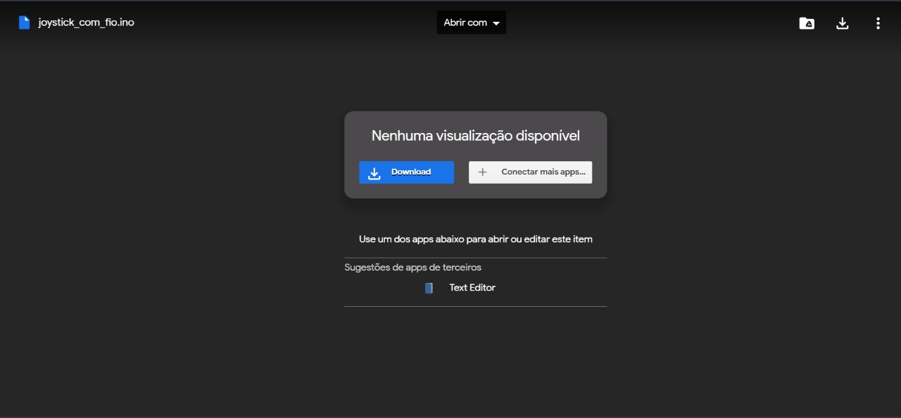

# Guia de Instação Arduíno e Código

  

Seja bem vindo ao guia de instalação para o software que vamos utilizar no curso, siga os próximos passos em sequência e caso tenha dificuldade comunique a algum dos professores.

## Primeira Etapa

O primeiro passo será fazer o donwload do arquivo que vamos utilizar, clique [NESTE LINK](https://downloads.arduino.cc/arduino-1.8.19-windows.exe). Vai aparecer uma janela no seu computador, clique no botão salvar, igual a este botão:

O download vai começar, você pode acomapnhar ele no canto esquerdo inferior da sua tela, após alguns minutinhos ele vai terminar e vai aparecer um síbolo igual a este:

## Segunda Etapa

Concluímos a primeira etapa do tutorial, agora vamos prosseguir para a instalação do nosso software, lembra daquele símbolo que apareceu no canto inferior esquerdo da sua tela? Agora você vai clicar nele, **IMPORTANTE: Pode aparecer um aviso do seu computador, clique em SIM**. Após isso uma janela igual a essa será aberta:

Agora nessa janela, você vai repetir os passos que vou te orientar aqui, os botões que você vai precisar clicar, vão estar destacados com um retângulo vermelho em volta.

### Passo 1 da Instalação

### Passo 2 da Instalação

### Passo 3 da Instalação

Após isso o computador vai começar a instalar o software sozinho, não precisamos clicar em nada, apenas esperar, vai aparecer uma tela de carregamento, igual a essa:

Quando a instalação terminar, uma tela igual a essa vai aparecer, você vai clicar em *close* assim como na imagem:

# Terceira Etapa

Agora que o software já foi instalado, precisamos abrir ele, vá para a sua área de trabalho, lá deve ter um ícone igual a esse:

De dois cliques nele e aguarde um pouco, o software vai abrir e quando abrir vai aparecer uma janela igual a está:

**Caso o seu não abra em tela cheia, basta clicar no ícone de tela cheia.**

# Quarta Etapa

Agora que já instalamos o software, vamos fazer o download do código, para isso clique [NESTE LINK](https://drive.google.com/file/d/1JwyjP7t78nQJGnpvgU2iu_WI07tHRG9T/view?usp=sharing)

Uma janela, semenlhante a essa vai abrir, clique em **Download**

Clique em salvar na próxima janela que vai abrir, e no canto inferior esquerdo, vai aparecer esse símbolo após alguns segundos:

Clique nesse símbolo e uma janela igual a essa vai se abrir:

Clique em **OK**

Após isso o software vai abrir com o código, a tela exibida será semelhante a essa:

E pronto, cheagamos ao fim desse tutorial
